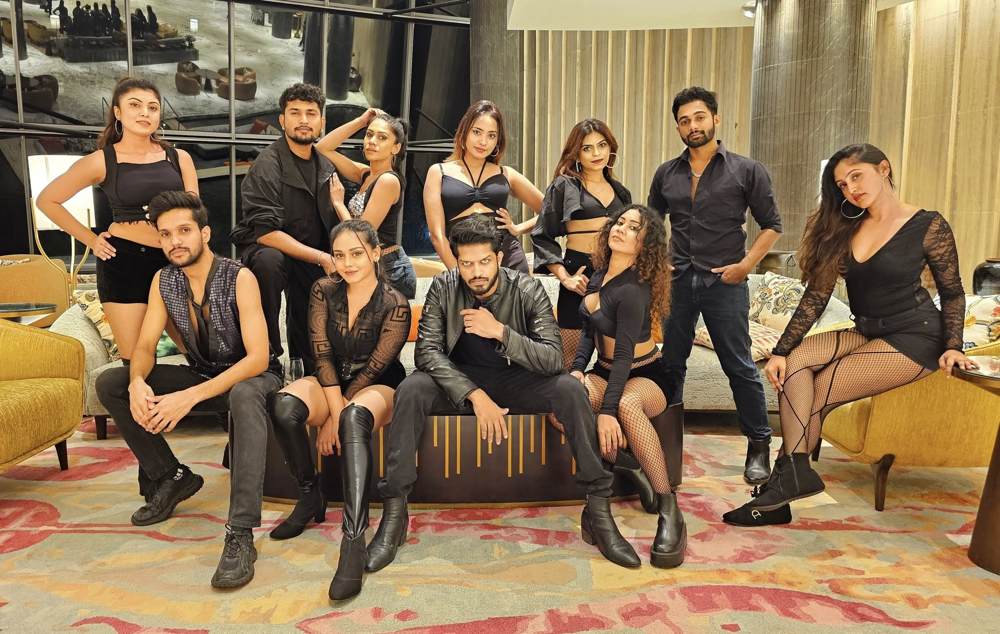

# Sway Dancers Official Website

Welcome to the official repository for the **Sway Dancers** website. Sway Dancers is a modern contemporary dance troupe based in Sri Lanka, performing Latin, Hip-Hop, Freestyle, Jazz, and Bollywood styles.



## 🚀 Live Demo
*(If you have a live link, add it here. e.g., https://swaydancers.lk)*

## ✨ Features

- **Modern Dark Aesthetic**: A sleek, professional dark-themed design with vibrant red accents `#E10600`.
- **Fully Responsive**: Mobile-first architecture ensuring the site looks great on all devices.
- **Interactive Elements**:
  - Smooth scroll navigation.
  - Sticky glassmorphism header.
  - Scroll-triggered reveal animations.
  - Custom JavaScript lightbox for the gallery.
  - Swipeable testimonials carousel.
- **Performance**: Optimized load times using semantic HTML and vanilla JavaScript.

## 🛠 Tech Stack

- **HTML5**: Semantic markup.
- **Tailwind CSS (CDN)**: Utility-first CSS framework for styling.
- **JavaScript (Vanilla)**: No heavy frameworks, just pure JS for interactivity.
- **Google Fonts**: 'Bebas Neue' for headings and 'Inter' for body text.

## 📂 Project Structure

```
SwayDancers/
├── assets/             # Project images and resources
│   ├── gallery/        # Gallery images
│   └── team.jpg        # Main hero/about image
├── index.html          # Main HTML entry point
├── main.js             # Interaction logic (Menu, Lightbox, Scroll)
└── README.md           # Project documentation
```

## 🏁 Getting Started

Since this project uses the Tailwind CSS CDN, there is no build step required for development.

1. **Clone the repository** (if using Git):
   ```bash
   git clone https://github.com/your-username/sway-dancers.git
   ```
2. **Open the project**:
   - Simply double-click `index.html` to open it in your web browser.
   - Or serve it using a local server like Live Server for VS Code.

## 🎨 Design Decisions

- **Typography**: Bold `Bebas Neue` headings capture the energy of dance, while `Inter` ensures readability for content.
- **Color Palette**: 
  - Background: Black (`#0B0B0B`)
  - Accent: Red (`#E10600`)
  - Text: White/Grey (`#F5F5F5`, `#9B9B9B`)

## 📝 License

This project is proprietary to Sway Dancers. All rights reserved.

---

**Developed with ❤️ for Sway Dancers**
